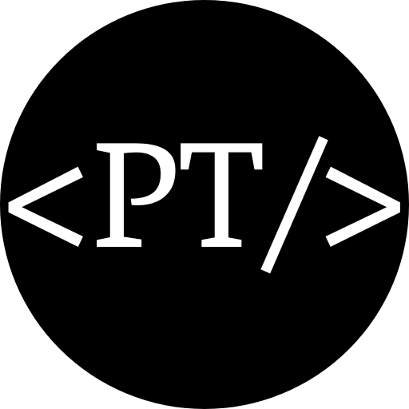

    
    <h3 align="center">Phil Traeger Portfolio Website</h3>

## Description

Welcome to the Phil Traeger Portfolio website! This project serves as a showcase of my skills, projects, and experiences. Whether you're a potential employer or just curious about my work, feel free to explore the various sections and get to know me better.

## Production Setup

To run this project in a production environment, follow these steps:

1. Edit the `.env` file to configure any necessary environment variables.
2. Edit the `.nginx/nginx.conf` file if additional Nginx configurations are needed.
3. Run the project using Docker Compose by executing the command `docker-compose.yml`.

## Development Setup

If you want to contribute or run the project locally for development purposes, use the following steps:

1. Install the necessary dependencies by running `npm i`.
2. Edit the `.env` file to set up local environment variables.
3. Start the development server by running `npm run dev`.

### Technologies Used

This project is built using the following technologies:

- **Nuxt.js**: A progressive Vue.js framework for building modern web applications.
- **Tailwind CSS**: A utility-first CSS framework for rapidly building custom designs.
- **Vue.js**: A JavaScript framework for building user interfaces.
- **Vue Router**: The official router for Vue.js applications.
- **Autoprefixer**: A PostCSS plugin to parse CSS and add vendor prefixes.
- **DaisyUI**: A set of robust UI components for Tailwind CSS.
- **Nuxt Icon**: A Nuxt module for generating optimized SVG icons.
- **PostCSS**: A tool for transforming styles with JavaScript plugins.

Feel free to explore the codebase, suggest improvements, or contribute to make this portfolio even better!

Thank you for checking out the Phil Traeger Portfolio website! If you have any questions or suggestions, feel free to reach out.

Happy coding! 🚀
